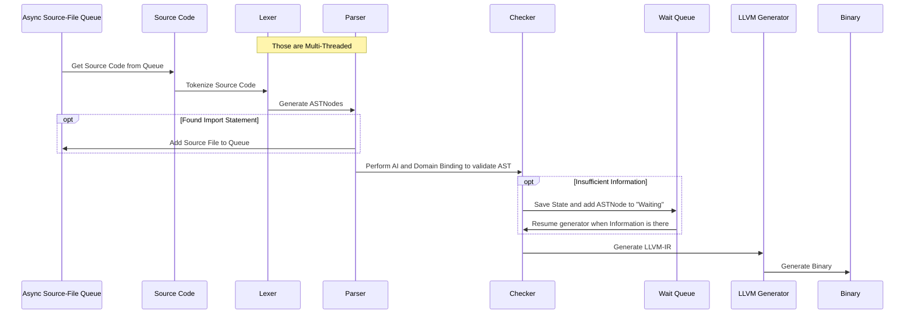

# More Information

- [Build Pipeline](#build-pipeline)
- [Handling Generics](#handling-generics)

## Build Pipeline

In this document we document what Steps are taken to compile source code into an executable binary.



## Handling Generics

Generics allow the developer to easily make a method or type hold different types. Generic types are notated by adding `<T>` where T is the name for the generic type.

For generics the compiler will generate a specialized method for all possible (and used) generic types.

Otter will also support "dependent typing", this means a generic type can be inferred by the compiler based on some constraint. For example, this could be used as followed:

```otter
#DynamicGeneric
enum MyEnum<T> {
    OPTION_1<MyStruct1>,
    OPTION_2<MyStruct2>;
}

struct ExampleStruct<T extends MyEnum> {
    ...
    type: T;
    data: *T.generic;
} 
```

In this example, when we create a Struct with the generic type `MyEnum.OPTION_1` the value for `type` would be "OPTION_1" and for `data` the type would be "MyStruct2".